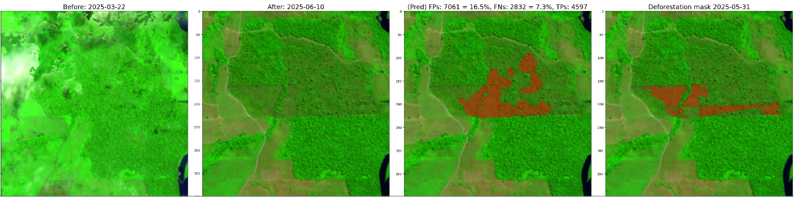

# Capacity_takehome: Deforestation predictions using S1/S2/LS/CBERS4A

- Task description: [Link](https://storage.googleapis.com/capacity_shared/Technical%20Take-Home%20Exercise%20Multi-Sensor%20Deforestation%20Detection.pdf)

- Slides with visuals and commentary: [Link](https://docs.google.com/presentation/d/1tItbbZQ-TN-Qxc1ZezJLTdLC7mL_EHSxQKBgPThgXWc/edit?usp=sharing)

## Notebooks and what they do
- [Exploration.ipynb](Exploration.ipynb): Visualize all available data for all events + show deforestation mask.
- [Data_Setup_and_Train.ipynb](Data_Setup_and_Train.ipynb): Create datasets + Train S2/S1 single sensor Siamese/Concat Unets + S1+S2 multisensor Concat Unet.

## Example Setup
- `conda create -n myenv python=3.11 pip -y && conda run -n myenv python -m pip install -r requirements.txt`
- run `./download_dataset.sh all --extract ` and move the data into data/

## Example S2 Prediction vs. Ground Truth

